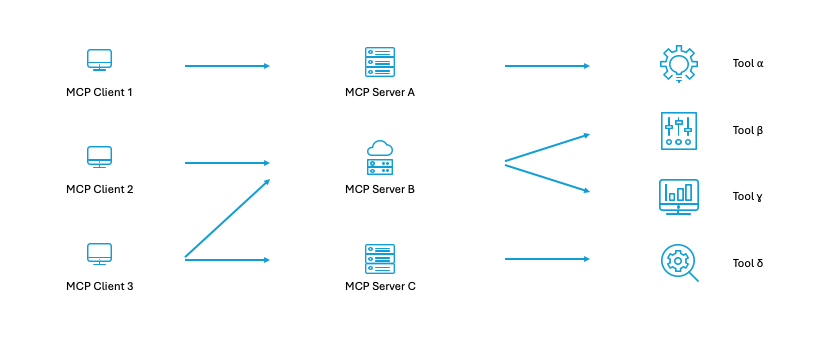
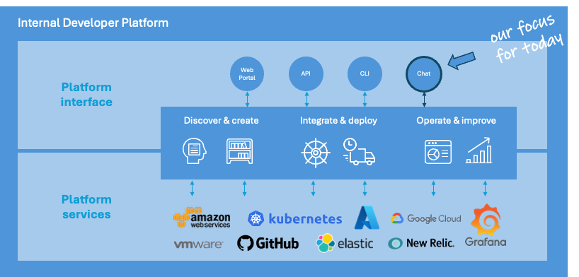
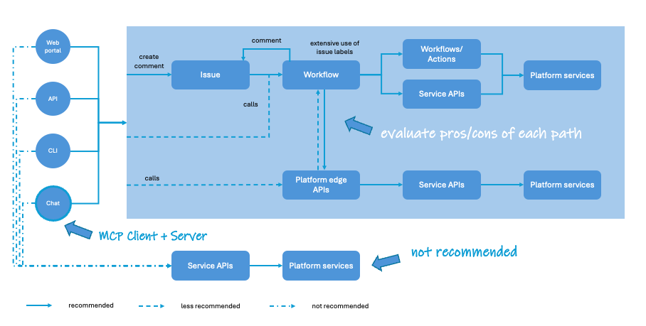
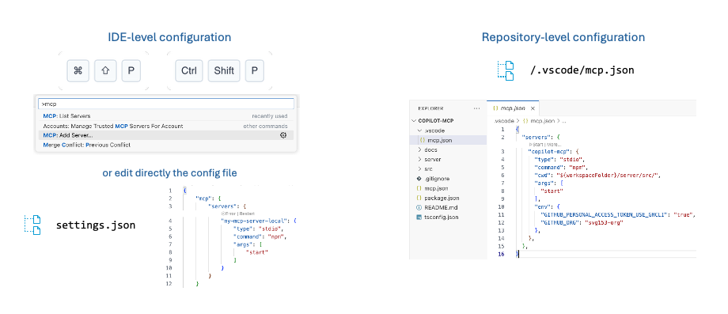

# workshop-github-copilot-mcp

Workshop about GitHub Copilot and MCP Servers: integrating MCP Servers in Visual Studio Code with the help of GitHub Copilot and create your own MCP Servers to provision development platform resources in your own way.

This workshop was first delivered at OpenSlava 2025.

## Introduction and general instructions

The workshop is structured around several examples of growing complexity. To support the learning process, and to simplify the deployment & execution of the several MCP servers as a containerized app, the solution to every workshop scenario will be available in a different branch. That is, typical buildpack/source-to-image tooling will be able to pick the right language/platform selection and deploy the MCP server as a containerized app with minimal previous configuration on your side.

The recommended approach is to follow the instructions in this ```README.md``` file, and rely on the solutions available in those branches in case of doubts or when stuck in a given step.

## Workshop pre-requisites

There are two pre-requisites:

- Visual Studio Code
- GitHub account with GitHub Copilot enabled -- free tier is more than enough for this workshop

We will be running MCP servers locally, so there is no need to have a cloud account or any other infrastructure/platform ready to host them. However, you are more than welcomed to try them out with any platform of your choice (e.g., as an Azure App Service app just deployed from VS Code if you have the Azure extension installed).

## Workshop agenda

This is the agenda for the workshop:

1. Introduction to Model Context Protocol (MCP)
2. How to leverage MCP to interface with an internal developer platform (IDP)
3. How to configure and run an MCP server in VS Code
4. MCP server "Hello World"
5. MCP server to integrate with GitHub
6. MCP server to integrate with Jira
7. Final words

## Workshop content

### 1. Introduction to Model Context Protocol (MCP)

See the diagram below and pay attention to the live presentation:



Three main takeaways:

- MCP Client: The component that has the conversational and agentic capabilities to infer user's intentions and connect with the right tool through the corresponding MCP Server.
- MCP Server: The component that implements tool integrations. It is strongly recommended to follow the 'dumb pipes and smart endpoints' design rule and design MCP servers to be as simple and lightweight as possible.
- Tool: The actual tool that we want to interface with. Typically, this is an API to encapsulate fine-grained services within the target tool/platform (that is, a 'smart endpoint').

### 2. How to leverage MCP to interface with an internal developer platform (IDP)

See the diagram below and pay attention to the live presentation:



Three main takeaways:

- An Internal Developer Platform is more than "just a portal".
- Platform interfaces are multiple: web, command line, a public API, and, of course, a virtual assistant powered by MCP.
- Every interface exposes and simplifies access to the actual platform services, enabling self-service capabilities (which is a key principle of developer experience) in a consistent way.

See the next diagram and continue attending the live presentation:



Three main takeaways:

- Consistency of the experience is key to DevEx. Do not aim for case-by-case integrations. They may seem simpler at the beginning, but sooner rather than later you will have diverging experiences, duplicated code for the same use cases, more maintenance/operation effort, and a more complex security setup, e.g., for roles and access management.
- Expose the self-service capabilities offered to end users as high-level/edge services. Those edge services will orchestrate all the steps needed to complete the user request.
- I strongly recommend to adopt an IssueOps approach. It is just a bit more effort but it will provide another self-service channel, as well as strong traceability and auditing about who asks and who approves this or that.

### 3. How to configure and run an MCP server in VS Code

See the diagram below and pay attention to the live presentation:



For this workshop we will be running MCP servers locally.

