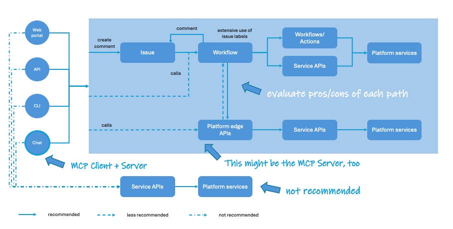
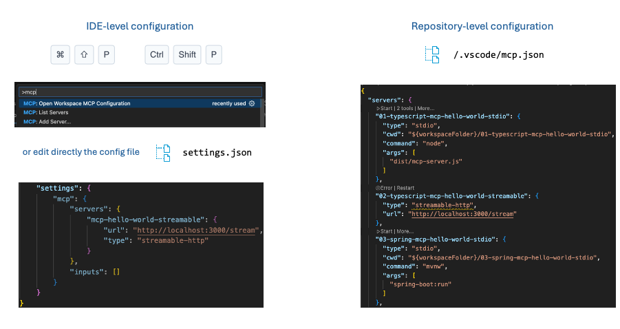

# workshop-mcp-servers

Workshop about MCP Servers: from building simple MCP Servers to advanced use cases for interacting and provisioning development platform resources in a self-service way. The workshop features extensively the MCP capabilities within Visual Studio Code provided by the GitHub Copilot extension, and it will use GitHub as the development platform of reference for the examples (although the same principles apply to other platforms or services).

This workshop was first delivered at OpenSlava 2025 with roots in a previous talk at OpenSouthCode 2025 along with Sergio Valverde @svg153.

## Introduction and general instructions

The workshop is structured around several activities of growing complexity. To support the learning process, to simplify the deployment & execution of the several MCP servers, and to allow everyone to follow the content at their own pace at home, the solution to every workshop activity will be available in a different folder.

The recommended approach is to follow the instructions in this ```README.md``` file, and rely on the solutions available in each solution folder in case of doubts or when stuck in a given step.

## Workshop pre-requisites

These are the pre-requisites for the workshop:

- Visual Studio Code
- GitHub account with GitHub Copilot enabled -- free tier is more than enough for this workshop
- Node.js 24
- Java 25

The rest of stuff, such as dependencies and tools, will be downloaded automatically during the workshop and as they will not require significant bandwidth, you don't need to prepare in advance.

We will be running MCP servers locally, so there is no need to have a cloud account or any other infrastructure/platform ready to host them. However, you are more than welcomed to try them out with any platform of your choice.

The workshop can be done without Visual Studio Code, a GitHub account or GitHub Copilot enabled. You may use any other IDE and MCP client of your choice but take into consideration that they might not be supported during the workshop (that is, community-based support based on workshop participants' know-how).

## Workshop agenda

This is the agenda for the workshop:

- [workshop-mcp-servers](#workshop-mcp-servers)
  - [Introduction and general instructions](#introduction-and-general-instructions)
  - [Workshop pre-requisites](#workshop-pre-requisites)
  - [Workshop agenda](#workshop-agenda)
  - [Workshop activities](#workshop-activities)
    - [1. Introduction to Model Context Protocol (MCP)](#1-introduction-to-model-context-protocol-mcp)
    - [2. How to leverage MCP to interface with an internal developer platform (IDP)](#2-how-to-leverage-mcp-to-interface-with-an-internal-developer-platform-idp)
    - [3. MCP server "Hello World"](#3-mcp-server-hello-world)
      - [3.1. Node.js with Typescript and stdio](#31-nodejs-with-typescript-and-stdio)
        - [3.1.1. Testing through the command line](#311-testing-through-the-command-line)
      - [3.2. Node.js with Typescript and Streamable HTTP](#32-nodejs-with-typescript-and-streamable-http)
        - [3.2.1. Testing through the command line](#321-testing-through-the-command-line)
      - [3.3. Java with Spring AI and stdio](#33-java-with-spring-ai-and-stdio)
        - [3.3.1. Testing considerations](#331-testing-considerations)
        - [3.3.2. Testing with MCP Inspector](#332-testing-with-mcp-inspector)
        - [3.3.3. Testing with Visual Studio Code and GitHub Copilot extension](#333-testing-with-visual-studio-code-and-github-copilot-extension)
      - [3.4. Java with Spring AI and Streamable HTTP](#34-java-with-spring-ai-and-streamable-http)
        - [3.4.1. Testing with MCP Inspector](#341-testing-with-mcp-inspector)
        - [3.4.2. Testing with Visual Studio Code and GitHub Copilot extension](#342-testing-with-visual-studio-code-and-github-copilot-extension)
      - [3.5. Java with Quarkus and stdio](#35-java-with-quarkus-and-stdio)
      - [3.6. Java with Quarkus and Streamable HTTP](#36-java-with-quarkus-and-streamable-http)
    - [4. MCP server integrating with GitHub](#4-mcp-server-integrating-with-github)
      - [4.1. MCP server for GitHub repos](#41-mcp-server-for-github-repos)
      - [4.2. MCP server for GitHub issues](#42-mcp-server-for-github-issues)
    - [5. Final words](#5-final-words)

## Workshop activities

### 1. Introduction to Model Context Protocol (MCP)

See the diagram below and pay attention to the live presentation:


Three main takeaways:

- MCP Client: The component that has the conversational and agentic capabilities to infer user's intentions and connect with the right tool through the corresponding MCP Server.
- MCP Server: The component that implements tool integrations. It is strongly recommended to follow the 'dumb pipes and smart endpoints' design rule and design MCP servers to be as simple and lightweight as possible.
- Tool: The actual tool that we want to interface with. Typically, this is an API to encapsulate fine-grained services within the target tool/platform (that is, a 'smart endpoint').

### 2. How to leverage MCP to interface with an internal developer platform (IDP)

See the diagram below and pay attention to the live presentation:


Three main takeaways:

- An Internal Developer Platform is more than "just a portal".
- Platform interfaces are multiple: web, command line, a public API, and, of course, a virtual assistant powered by MCP.
- Every interface exposes and simplifies access to the actual platform services, enabling self-service capabilities (which is a key principle of developer experience) in a consistent way.

See the next diagram and continue attending the live presentation:



Three main takeaways:

- Consistency of the experience is key to DevEx. Do not aim for case-by-case integrations. They may seem simpler at the beginning, but sooner rather than later you will have diverging experiences, duplicated code for the same use cases, more maintenance/operation effort, and a more complex security setup, e.g., for roles and access management.
- Expose the self-service capabilities offered to end users as high-level/edge services. Those edge services will orchestrate all the steps needed to complete the user request.
- I strongly recommend to adopt an IssueOps approach. It is just a bit more effort but it will provide another self-service channel, as well as strong traceability and auditing about who asks and who approves this or that.

### 3. MCP server "Hello World"

There are two possible transports to configure our MCP servers:

- **stdio**: The MCP server runs in a local process using stdio/stdout to exchange information.
- **Streamable HTTP**: The latest model suitable for larger scale deployments, can be executed locally or remotely, and can work with multiple clients simultaneously.

There is a third method now deprecated, SSE or server-sent events. The Internet is full of examples of this transport method so be aware of its state before going on.

We are going to build MCP servers with two tools:

- **greetPerson**: This tool will just respond with a string greeting a person. The name of the person is an input parameter for the tool.
- **greetAudience**: This tool will respond with a message suitable to greet the whole audience of a given event. Tool parameters are the event name and its location.

The provided solutions are built in Node.js/Typescript, Java/Spring AI, and Java/Quarkus. The code for the MCP servers are located in these folders:

- ```01-typescript-mcp-hello-world-stdio```: The "Hello World" MCP server with stdio transport built with Node.js/Typescript.
- ```02-typescript-mcp-hello-world-streamable```: The "Hello World" MCP server with Streamable HTTP transport built with Node.js/Typescript.
- ```03-spring-mcp-hello-world-stdio```: The "Hello World" MCP server with stdio transport built with Java/Spring AI.
- ```04-spring-mcp-hello-world-streamable```: The "Hello World" MCP server with Streamable HTTP transport built with Java/Spring AI.
- ```05-quarkus-mcp-hello-world-stdio```: The "Hello World" MCP server with stdio transport built with Java/Quarkus.
- ```06-quarkus-mcp-hello-world-streamable```: The "Hello World" MCP server with Streamable HTTP transport built with Java/Quarkus.

Testing the MCP servers can be done through multiple channels:

- Through the command line. This is the most direct way as it goes directly to the MCP API and not through the MCP client conversational interface.
- With MCP Inspector. See the official guide here: [MCP Inspector](https://modelcontextprotocol.io/docs/tools/inspector)
- With Visual Studio Code built-in MCP client provided by the GitHub Copilot extension working in Agent mode.
- With any available MCP client. See a very exhaustive list here: [MCP Example Clients](https://modelcontextprotocol.io/clients)

Throughout the workshop we will experiment with those channels.

#### 3.1. Node.js with Typescript and stdio

TBC

##### 3.1.1. Testing through the command line

Now that the MCP server is running, it is time to test it. In this case, lets use directly stdio in the terminal running the server.

When using stdio testing involves simply typing the request Json in the terminal running the server and looking at the responses in that terminal. These are three key examples for your reference.

To list the tools available in the server:

```sh
{"jsonrpc":"2.0","id":"1","method":"tools/list","params":{}}
```

To greet a person named Alice:

```sh
{"jsonrpc":"2.0","id":"2","method":"tools/call","params":{"name":"greetPerson","arguments":{"name":"Alice"}}}
```

To greet the audience at OpenSlava event in Bratislava:

```sh
{"jsonrpc":"2.0","id":"3","method":"tools/call","params":{"name":"greetAudience","arguments":{"event":"OpenSlava","location":"Bratislava"}}}
```

#### 3.2. Node.js with Typescript and Streamable HTTP

TBC

##### 3.2.1. Testing through the command line

Now that the MCP server is running, it is time to test it. In this case we will be using ```curl``` commands.

We will add some additional complexity to work as a real MCP client would do. First, we must send an initialization request to prepare a session with the MCP server. We will take note of the generated session id and that session id will be reused to process the subsequent tool requests.

To send the initialization request:

```sh
curl -X POST http://localhost:3000/stream \
    -H "Content-Type: application/json" \
    -H "Accept: text/event-stream, application/json" \
    -d '{
  "jsonrpc": "2.0",
  "id": "1",
  "method": "initialize",
  "params": {
    "protocolVersion": "2025-06-18",
    "capabilities": {
        "sampling": {},
        "elicitation": {}
    },
    "clientInfo": {
      "name": "my terminal",
      "version": "N/A"
    }
  }
}'
```

The session id can be located in the MCP server process terminal.

Next, to list the available tools:

```sh
curl -X POST http://localhost:3000/stream \
    -H "Content-Type: application/json" \
    -H "Accept: text/event-stream, application/json" \
    -H "mcp-session-id: <SESSION_ID>" \
    -d '{
  "jsonrpc": "2.0",
  "id": "2",
  "method": "tools/list",
  "params": {}
}'
```

To greet a person named Alice:

```sh
curl -X POST http://localhost:3000/stream \
    -H "Content-Type: application/json" \
    -H "Accept: text/event-stream, application/json" \
    -H "mcp-session-id: <SESSION_ID>" \
    -d '{
  "jsonrpc": "2.0",
  "id": "3",
  "method": "tools/call",
  "params": {
    "name": "greetPerson",
    "arguments": {
      "name": "Alice"
    }
  }
}'
```

To greet the audience at OpenSlava event in Bratislava:

```sh
curl -X POST http://localhost:3000/stream \
    -H "Content-Type: application/json" \
    -H "Accept: text/event-stream, application/json" \
    -H "mcp-session-id: <SESSION_ID>" \
    -d '{
  "jsonrpc": "2.0",
  "id": "4",
  "method": "tools/call",
  "params": {
    "name": "greetAudience",
    "arguments": {
      "event": "OpenSlava",
      "location": "Bratislava"
    }
  }
}'
```

And, finally, it is a good practice to terminate the session with a DELETE command:

```sh
curl -X DELETE http://localhost:3000/stream \
    -H "Content-Type: application/json" \
    -H "Accept: text/event-stream, application/json" \
    -H "mcp-session-id: <SESSION_ID>" \
    -d '{
  "jsonrpc": "2.0",
  "id": "5"
}'
```

#### 3.3. Java with Spring AI and stdio

TBC

##### 3.3.1. Testing considerations

Now that the MCP server is ready, it is time to test it. In this case we will be using the MCP Inspector tool and the built-in MCP client in Visual Studio Code with GitHub Copilot extension.

With MCP Inspector we will run some simple tests that will help us to validate that the MCP server works correctly without the added complexity of a conversational interface. With Visual Studio Code and GitHub Copilot extension we will add the conversational interface that allows, thanks to the LLMs ability to infer what we want to do, connect our errands with the actual MCP servers that know how to do them.

Regardless of the MCP client in use, take into consideration that when using stdio transport the MCP client is responsible for launching the MCP server.

##### 3.3.2. Testing with MCP Inspector

To launch MCP Inspector, run this command from your terminal in the folder containing the MCP server:

```sh
npx @modelcontextprotocol/inspector
```

Ensure that transport type is ```STDIO```, add ```./mvnw``` as the command and ```spring-boot:run``` as the arguments. Then click the ```Connect``` button below.

Alternatively, you can add the MCP server command directly when launching MCP Inspector as an extra parameter:

```sh
npx @modelcontextprotocol/inspector ./mvnw spring-boot:run
```

After connecting with the MCP server, the bottom panel will show the command history and notifications received from the server. At this moment, two commands have been sent: one to initialize the session and one to set the debug level.

Now, locate ```Tools``` in the top menu, click on it, then click on ```List Tools``` to confirm that everything is working as expected and the two configured tools are available.

You can click on any of them, provide the desired parameters and click on ```Run Tool``` to test that the received output is as expected.

As you progress issuing requests, the history pannel at the bottom will reflect the changes in the conversation.

Once you are finished, click the ```Disconnect``` button on the left panel and kill MCP Inspector in the terminal.

##### 3.3.3. Testing with Visual Studio Code and GitHub Copilot extension

Let's test the MCP server with the additional conversation interface available in the built-in MCP client in Visual Studio Code provided by the GitHub Copilot extension when working in Agent mode.

To configure the built-in MCP client to connect with the MCP server, see the diagram below and pay attention to the live presentation:



You can reuse the configuration available in the workshop repository (MCP servers at the repo-level provided in the file ```.vscode/mcp.json``` as just explained) or configure the servers from scratch in your workspace (MCP servers at the IDE-level).

When adding a new server at the IDE-level, pay attention to the prompts asking for the transport and, depending on which one, the executable or server URL. Visual Studio Code also allows you to add servers from a curated registry, from npm & pip packages, or from Docker images.


Once the server is added, you have to start it before the Copilot chat panel can interact with it. To start a server or check its status, use the ```MCP: List Servers``` command in Visual Studio Code.

It is also worth checking that Copilot has enabled our MCP server. It is also worth noting that if you have more than 128 tools enabled through MCP servers, Visual Studio Code warns us that the experience may be degraded, which in practice means that our own MCP server might be ignored. To look for both things, select the tools icon in the Copilot chat panel while in Agent mode:


It is also possible to automate this in the Copilot chat panel configuration.


Once everything is ready, it is time to test the full integration. Be imaginative and try out different ways of asking the agent allowing it to infer that you want to greet someone. For example:

```text
I want to greet Jozef
I want to greet the audience attending OpenSlava in the beautiful city of Bratislava
```

Note that although Copilot will infer your intent and map it to the right tool, you will have the final word before the tool is executed. This is deliberate to prevent any unwanted side-effect.


#### 3.4. Java with Spring AI and Streamable HTTP

TBC

##### 3.4.1. Testing with MCP Inspector

Now that the MCP server is up and running, it is time to test it. Let's begin with the MCP Inspector tool. The main difference with the stdio example is that the MCP server is not started by the MCP Inspector, it must be up and running before launching the connection.

As mentioned before, Streamable HTTP is still not fully supported in Spring AI 1.0.3 so we will be using SSE to make the connection.

It you don't have MCP Inspector still up, run this command from your terminal (folder does not matter this time):

```sh
npx @modelcontextprotocol/inspector
```

Ensure that transport type is ```SSE```, add ```http://localhost:3001/sse``` as the MCP server URL and ensure that the connection is managed via proxy. Press the ```Connect``` button below to begin the session. From now on, you may work in the same way you did before for the stdio server.

After connecting with the MCP server, the bottom panel will show the command history and notifications received from the server. At this moment, two commands have been sent: one to initialize the session and one to set the debug level.

Now, locate ```Tools``` in the top menu, click on it, then click on ```List Tools``` to confirm that everything is working as expected and the two configured tools are available.

You can click on any of them, provide the desired parameters and click on ```Run Tool``` to test that the received output is as expected.

As you progress issuing requests, the history pannel at the bottom will reflect the changes in the conversation.

Once you are finished, click the ```Disconnect``` button on the left panel and kill MCP Inspector in the terminal.

##### 3.4.2. Testing with Visual Studio Code and GitHub Copilot extension

Let's test the MCP server with the additional conversation interface available in the built-in MCP client in Visual Studio Code provided by the GitHub Copilot extension when working in Agent mode.

The configuration is similar to the stdio example. The only difference is to select the correct transport type and the URL where the MCP server is listening to connections.


#### 3.5. Java with Quarkus and stdio

TBC

#### 3.6. Java with Quarkus and Streamable HTTP

TBC

### 4. MCP server integrating with GitHub

Previous examples were great to set the tone and get a basic understanding about MCP servers and how to interact with them.

In this section we will be doing a couple more ambitious MCP servers that will integrate with GitHub repos and GitHub issues. This is a fictional use case but close to the real ones in which we facilitate end users of a development platform the access to the resources they need. They main difference between this simpler example and a real-life development platform server, is that we will be using our personal GitHub account and repos, instead or users and repos within an organization.

We will build both MCP servers with Streamable HTTP transport and in Typescript, which is a great way to leverage the GitHub SDK in that language a.k.a. the Octokit.

The provided solution code will be available in folders ```07-typescript-mcp-github-repos``` and ```08-typescript-mcp-github-issues```.

#### 4.1. MCP server for GitHub repos

TBC

#### 4.2. MCP server for GitHub issues

TBC

### 5. Final words
